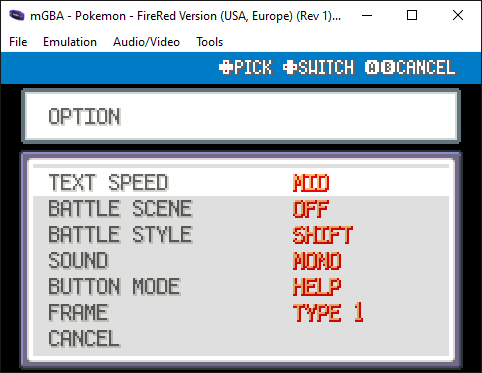
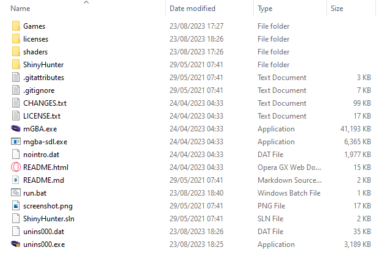
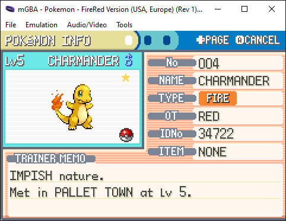

## Automated shiny hunting

This procedure utilizes the [mGBA](https://github.com/mgba-emu/mgba) mGBA emulator to control actions related to save files positioned just before choosing a desired starter Pokémon. The program operates by automating the execution of keyboard commands for selecting the starter, assessing its statistics, and subsequently soft-resetting the game. This sequence is repeated multiple times with the goal of persisting until encountering a rare shiny ⭐ Pokémon.

After conducting experiments, I have identified the following configurations that yield effective outcomes:

1. Apply a 10x fast forward to the mGBA emulator.

2. Set the target frames per second (FPS) to 90.

3. Maintain the dimensions of the emulator window without making any changes.

4. Apply fast forward to each emulator window with Shift+Tab before pressing the enter key to initiate the hunting process.

5. Due to timing, make your character name 3 long and your rivals 4 long; it might work the other way too.

6. This things settings need to be pretty exact for the timings I have found.



Dropping a copy of the mGBA emulator files in the same directory as the shiny-hunter-master is how I do it!



Then set the "path_to_pokemon_fire_red.gba" in the below .bat Once done, all you need to do is double-click the .bat to start both emulator instances.

## Usage

```.bat

@echo off
cd /d %~dp0

start mGBA.exe "path_to_pokemon_fire_red.gba"
start mGBA.exe "path_to_pokemon_fire_red.gba"
cmd /k dotnet run --project .\ShinyHunter\ShinyHunter.csproj

```
## Create .bat

To create this .bat simply fill out all the relevant information from the above template, then create a "run.txt" and copy and paste it to the "run.txt" then change the .txt to .bat you will then have a .bat to start the process.

This program is designed to be used with running processes that have a save files positioned in front of your chosen starter Pokémon. It continually sends keystrokes to pick the starter, examine its stats, and reset the game until a shiny ⭐ Pokémon is discovered.


## Detection technique

The shiny ⭐ icon on the Pokemon's status page is detected by looking for its color of <span style="color: rgb(255, 214, 82)">rgb(255, 214, 82)</span> at expected pixel coordinates in a screenshot. When found, the program exits, leaving the emulator running and awaiting further input.



## Why not just use PKHeX?

Because this is more fun.

## Potential enhancements

* Support unbounded fast-forward speed
* Make the process less timing-based/reliant on repeating key presses.
* Other shiny hunt scenarios (breeding, random encounters)
